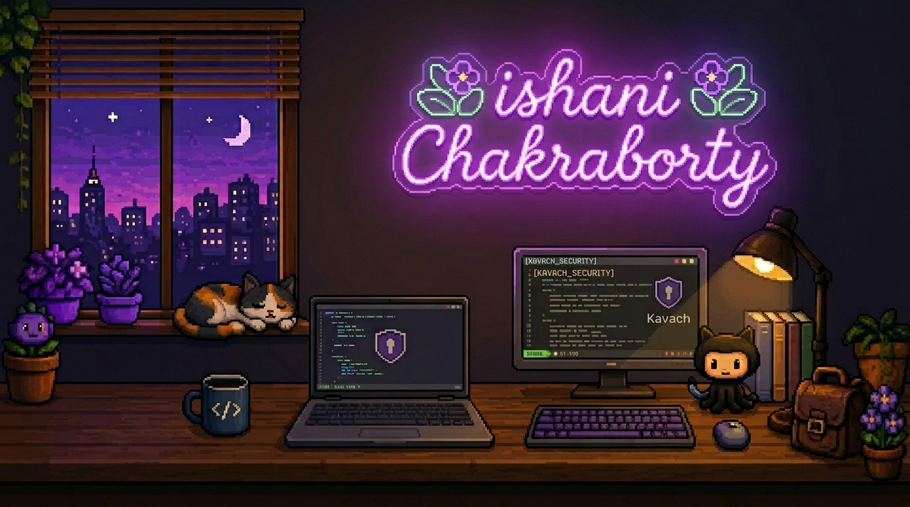

<div align="center">



<br>


<br><br>

<a href="https://github.com/Ishani018">GitHub</a>
&nbsp;&nbsp;•&nbsp;&nbsp;
<a href="https://www.linkedin.com/in/ishani-chakraborty-722708296/">LinkedIn</a>
&nbsp;&nbsp;•&nbsp;&nbsp;
<a href="mailto:ishani.chakraborty2005@gmail.com">Email</a>

</div>

---

##  About

Hi! I'm **Ishani**.

I'm a Computer Science student at **PES University** who enjoys building secure AI systems, full-stack products, and cozy pixel-art games.

Currently researching **AI Security** at **IIT Kharagpur**, leading my capstone project **Kavach**, and spending the rest of my time building games.

---

##  Active Projects

### Kavach

Runtime security monitor for LLM agents.

- Runtime tool-call inspection
- 400+ attack signatures
- Multi-stage detection pipeline
- Targeting AISec 2026

<br>

### AI Insurance Pricing Framework

Research @ IIT Kharagpur

Developing an insurance pricing framework for organizations deploying LLMs using benchmark evaluation and governance scoring.

<br>

### Potted

A cozy pixel-art nursery simulator where players grow flowers, collect pets and decorate their own little shop.

---

##  Featured Projects

### Potted

A relaxing pixel-art nursery simulator focused on decorating, collecting plants, and caring for pets.

`React Native`

---

### FinLit

Financial literacy RPG where players navigate careers, investments and life events.

`React Native` • `Expo` • `FastAPI`

---

### Rasoi

A cozy cooking simulator celebrating regional Indian cuisine.

`React Native`

---

### Word Search Puzzle Generator

AI-powered SaaS for generating KDP-ready puzzle books.

`Next.js` • `TypeScript` • `Groq API`

---

### Automated Leave Management System

Leave approval platform with CI/CD automation.

`React` • `Node.js` • `GitHub Actions`

---

##  Achievements

- 1st Place — PES OS Forensic Edition CTF
- Kavach selected for the JPMC Innovation Panel
- B.Tech Computer Science @ PES University (CGPA: 8.33)

---

##  Research

### IIT Kharagpur

Researching an insurance pricing framework for organizations deploying LLMs.

Areas of interest:

- AI Security
- Governance
- Hallucination Risk
- Privacy
- Benchmark Evaluation

<br>

### SPJIMR

Designed an NLP pipeline across **800+ annual reports** using:

- Named Entity Recognition
- Semantic Search
- Topic Modelling (LDA)

---

##  Tech Stack

```text
Languages
Python • TypeScript • JavaScript • C • HTML • CSS

Frameworks
React • React Native • Next.js • FastAPI • Tailwind CSS

Tools
Git • GitHub Actions • SQL • Wireshark • Burp Suite • Kali Linux
```

---

##  GitHub Activity

<p align="center">


</p>

<br>

<p align="center">


</p>

<br>

<p align="center">


</p>

---

##  Connect

<div align="center">

<a href="mailto:ishani.chakraborty2005@gmail.com">Email</a>

•

<a href="https://github.com/Ishani018">GitHub</a>

•

<a href="https://www.linkedin.com/in/ishani-chakraborty-722708296/">LinkedIn</a>

</div>

<br>

<div align="center">

**Always building. Always learning.**

</div>
````
