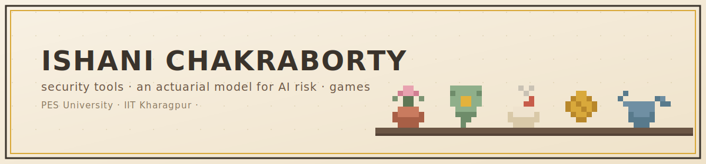

CS senior @ PES University, Bangalore · research intern @ IIT Kharagpur  
building security tooling, an actuarial model for AI risk, and a small pile of games on the side.

 

## currently

**Kavach** — runtime security layer for LLM agents. Screens every tool call against a 400-pattern attack library before execution, routed across four specialized detection modules. Red-teaming turned up a 3.36% bypass rate via Windows system command substitution; traced the root cause and shipped a fix ahead of submission. Targeting AISec 2026 (ACM CCS). PES capstone, lead researcher.

**AI Insurance Pricing Framework** — IIT KGP, with Prof. Pabitra Mitra. A two-step risk model (automated benchmark scoring + governance checklist) that sorts LLM deployments into insurance coverage tiers with set premiums, built for small businesses deploying AI in India. Adapting an expert-validated risk severity scale for finer granularity so it can work as a pricing input — first time that's been done.

## games — built solo, art included

| project | what it is | stack |
|:---|:---|:---|
| 🪴 **Potted** | pixel-art plant nursery — grow flowers, collect pets, decorate rooms | `React Native` `Reanimated 3` `Expo AV` |
| 🍛 **Rasoi** | Indian cooking sim, regional dish art across two kitchens | `React Native` `Expo` |
| 💸 **FinLit** | financial literacy RPG, 57 life events from 18–75 | `React Native` `Expo` `FastAPI` |
| 🔤 **Pause** | word search game for uptosix (family's edtech studio) | `React Native` `Zustand` |

## other projects

**Pramaan** — credit decisioning engine for supply-chain fraud; circular-trading detection via a counterparty intelligence engine. Built for the Intelli-Credit hackathon. `FastAPI` `React`

**SPJIMR research** — NLP pipeline (dynamic vocabulary + NER filters) that pulled BRSR sections out of 800+ annual reports, then LDA and semantic search to surface practice-rooted ESG themes over corporate buzzwords.

**Word Search Puzzle Book Generator** — SaaS for KDP-optimized puzzle books. AI-driven theme expansion, server-side auth, client-side PDF generation. `Next.js 14` `TypeScript` `Groq API`

## a few things

- 🥇 1st place, PES OS Forensic Edition CTF v2026
- 🏦 Kavach selected for the JPMC innovation panel
- 🎓 8.33 CGPA, B.Tech CSE @ PES (2023–2027)

## stack

